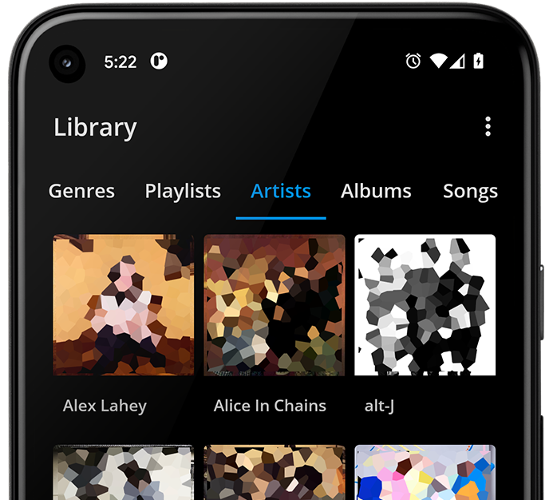

## S2 Music Player

### Welcome!

S2 Music Player is an app for managing and playing local music on an Android device, as well as music streamed via Jellyfin, Emby or Plex

The aim is to provide all of the options you'd expect from a music player, wrapped up in a minimalist, intuitive and modern design.

 

 

### Features

- Android Auto
- Batch tag editing
- Chromecast
- Album shuffle
- Sleep timer
- Custom EQ & Preamp
- Replay Gain
- Day/Night & Themes
- Jellyfin, Emby & Plex
- Dedicated artwork server
- Embedded lyrics

S2 is currently available for download on the [Google Play Store](https://play.google.com/store/apps/details?id=com.simplecityapps.shuttle)

The app is limited to a 2 week free trial, after which playback speed is slowly increased.

### Community

There's an active [Discord community](https://discord.gg/ESyjVgTBWa) for discussing all things relating to S2, Music & Android dev.

You can find me there as @timusus

### Open source

The S2 source code is open sourced in good faith, for transparency and educational purposes.

If you have features or fixes, I ask that you please consider contributing to this codebase, rather than releasing your own version.

This codebase represents years of hard work and learning as I've matured as an Android developer. I humbly request that you don't release low-effort clones for the sake of removing the pay-wall, or
providing your own ads/other monetization strategies. If the app should be free, I'd rather make it that way myself.

## Contributing to the Project

Please read the [contribution guide](CONTRIBUTING.md) for details on how to contribute to this project.
