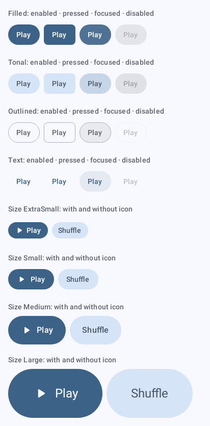
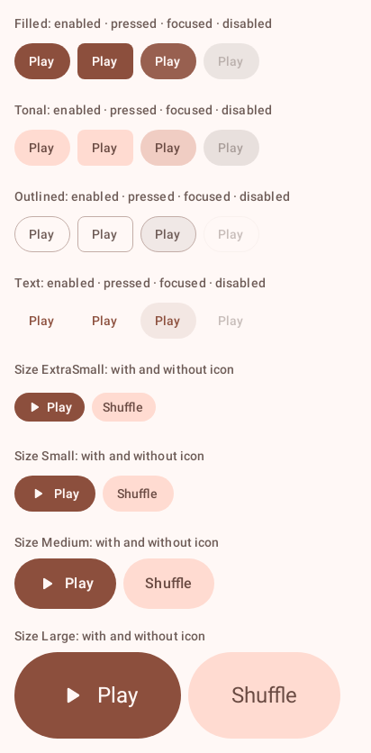
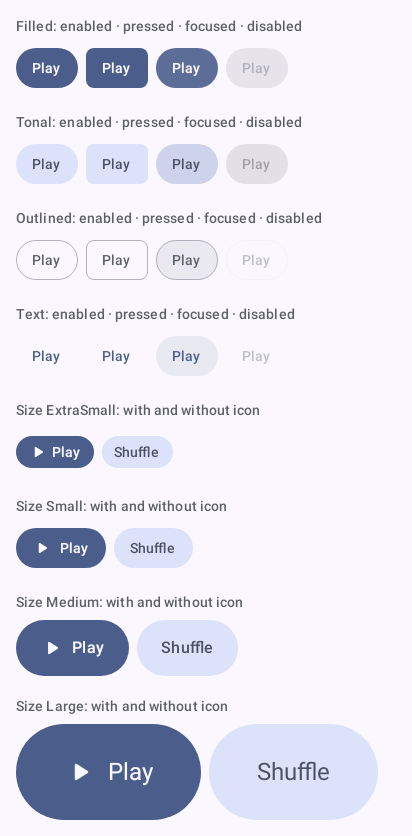
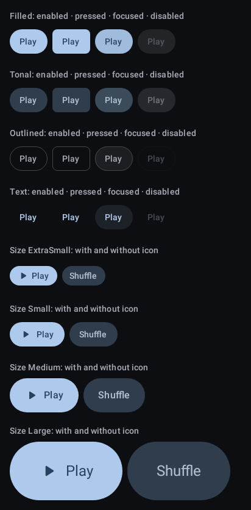
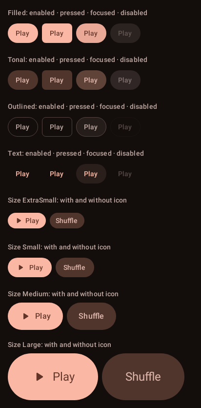
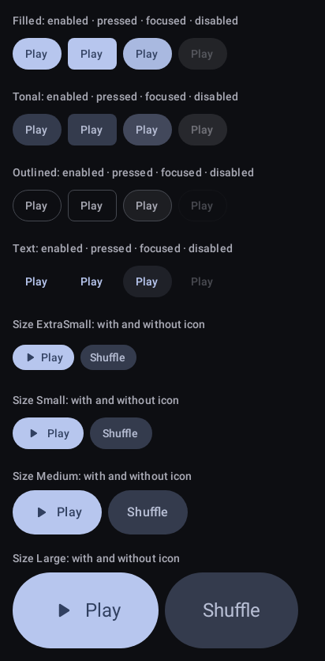
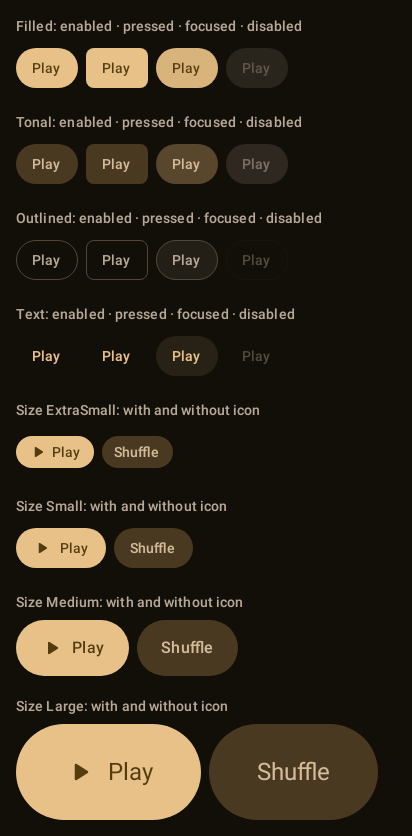
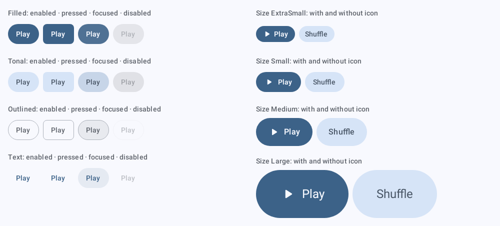
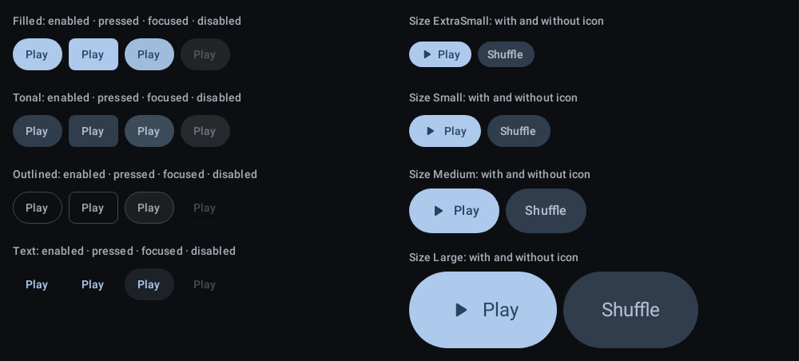

# `button`: Button

[All components](index.md)

States: filled, tonal, outlined, text; enabled, pressed, focused, disabled; extra small to large, with and without icon.

## Compact, light

| Brand | Warm seed | Cool seed | Low-chroma seed |
| --- | --- | --- | --- |
|  |  |  |  |

## Compact, dark

| Brand | Warm seed | Cool seed | Low-chroma seed |
| --- | --- | --- | --- |
|  |  |  |  |

## Expanded, light

| Brand |
| --- |
|  |

## Expanded, dark

| Brand |
| --- |
|  |
