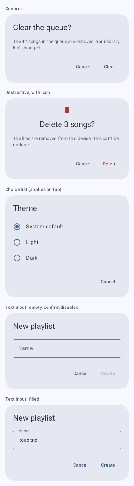
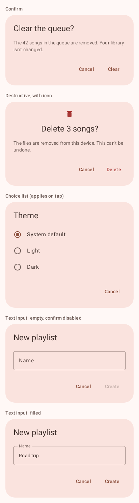
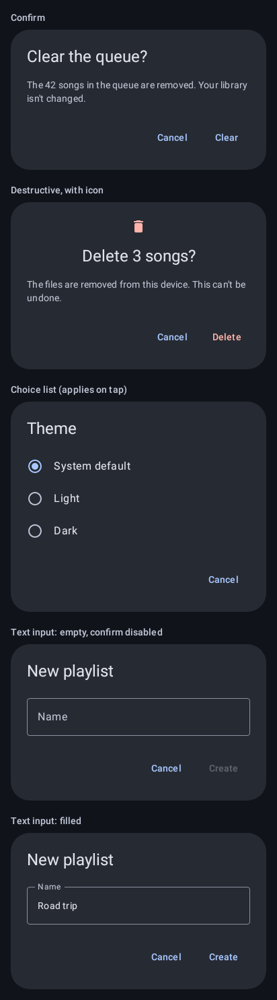
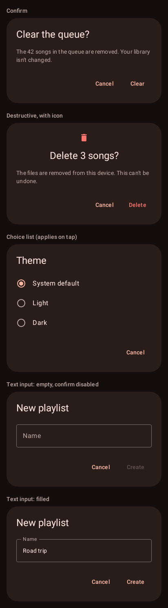
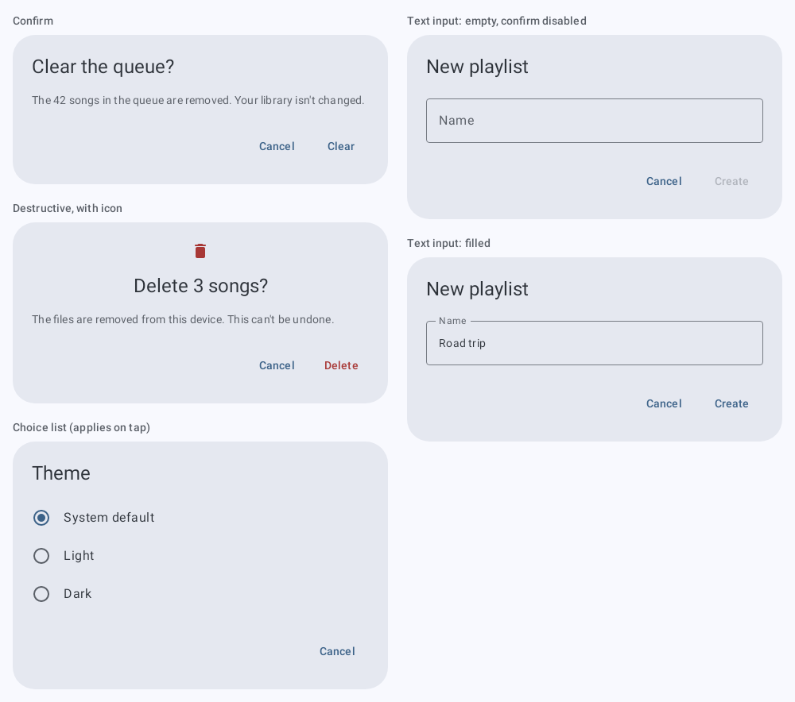
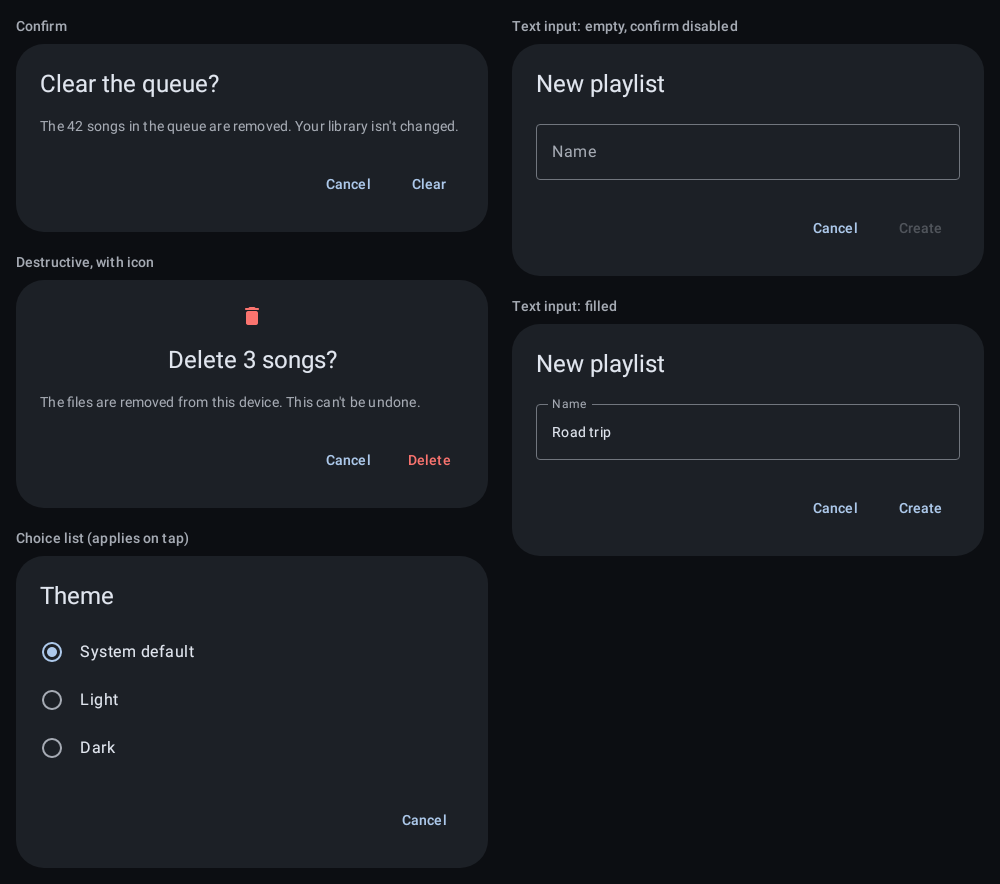

# `dialog`: Dialog

[All components](index.md)

States: confirm; destructive with icon; choice list; text input with confirm disabled; text input filled.

## Compact, light

| Brand | Warm seed |
| --- | --- |
|  |  |

## Compact, dark

| Brand | Warm seed |
| --- | --- |
|  |  |

## Expanded, light

| Brand |
| --- |
|  |

## Expanded, dark

| Brand |
| --- |
|  |
