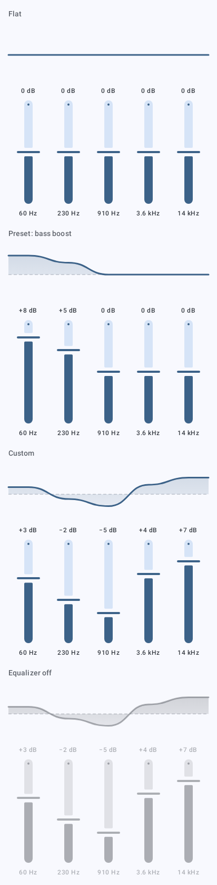
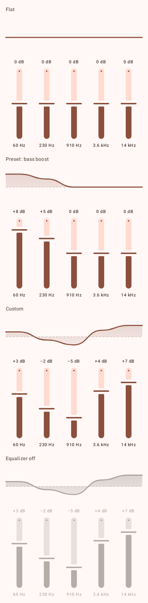
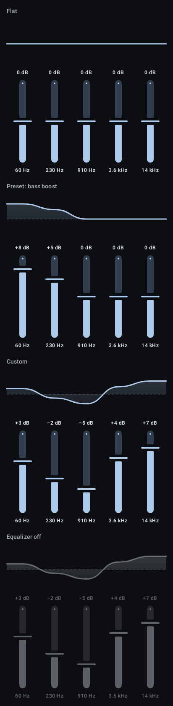
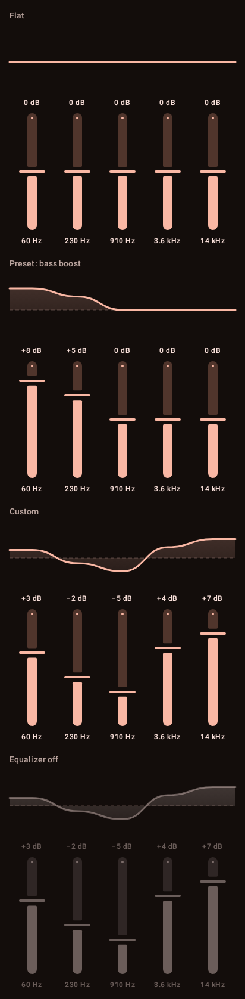
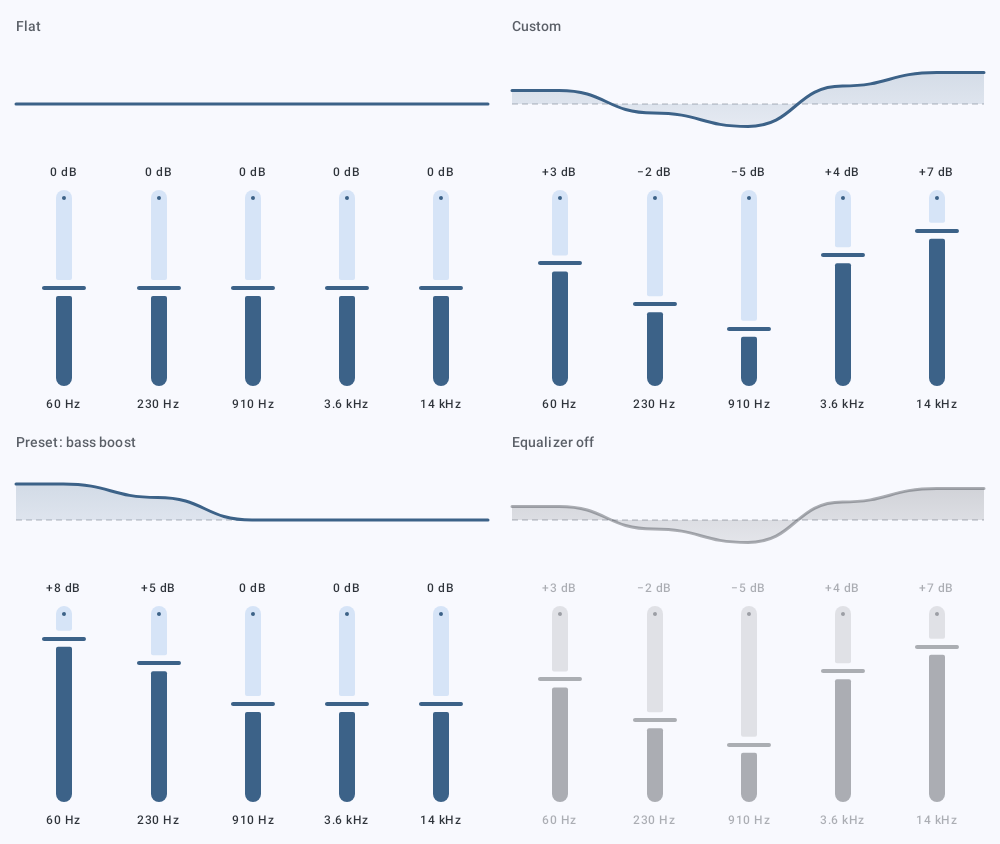
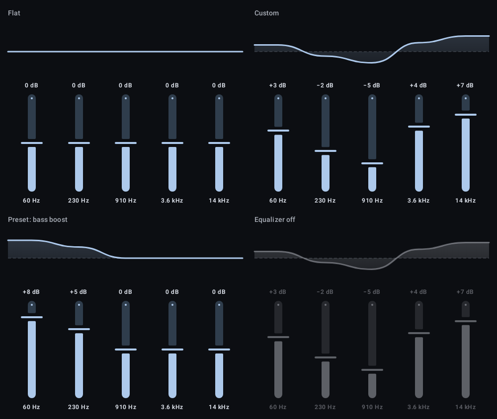

# `eq-curve`: Equalizer curve

[All components](index.md)

States: flat; preset; custom; equalizer off.

## Compact, light

| Brand | Warm seed |
| --- | --- |
|  |  |

## Compact, dark

| Brand | Warm seed |
| --- | --- |
|  |  |

## Expanded, light

| Brand |
| --- |
|  |

## Expanded, dark

| Brand |
| --- |
|  |
