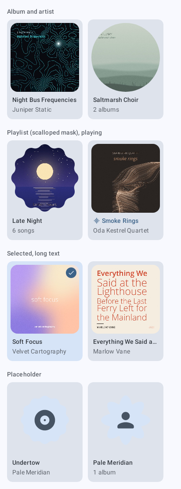
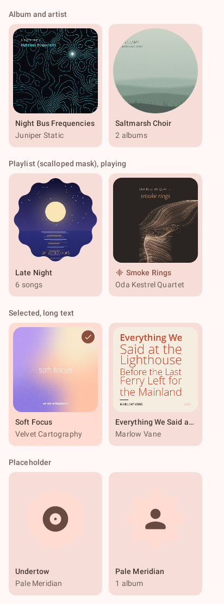
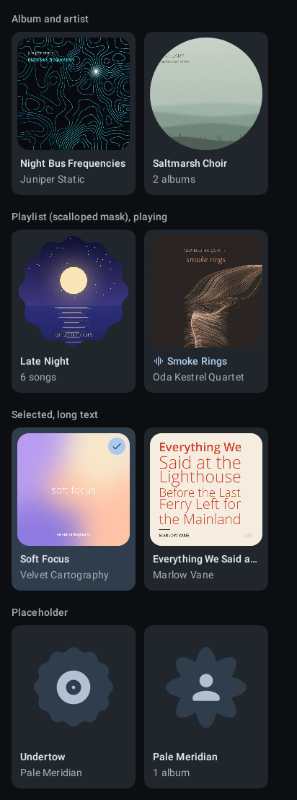
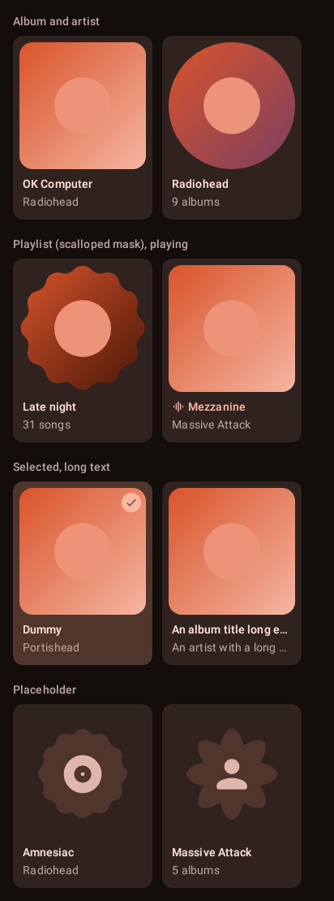
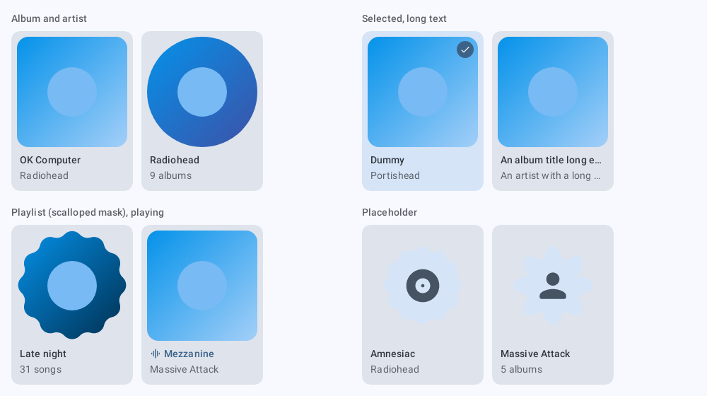
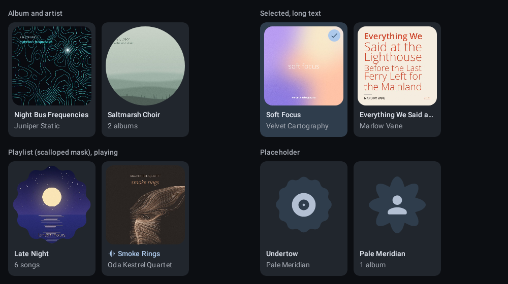

# `grid-tile`: Grid tile

[All components](index.md)

States: album, artist, playlist with the scalloped mask; playing; selected; long text; placeholder.

## Compact, light

| Brand | Warm seed |
| --- | --- |
|  |  |

## Compact, dark

| Brand | Warm seed |
| --- | --- |
|  |  |

## Expanded, light

| Brand |
| --- |
|  |

## Expanded, dark

| Brand |
| --- |
|  |
