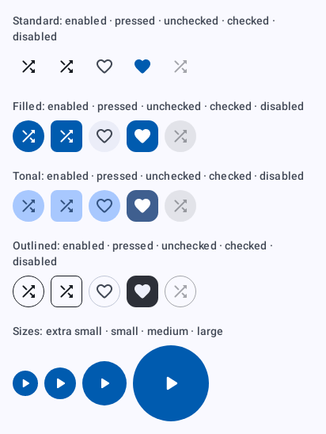
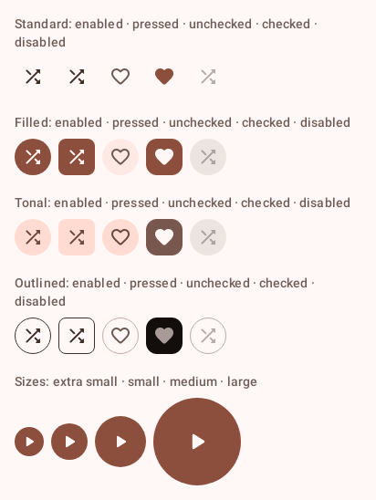
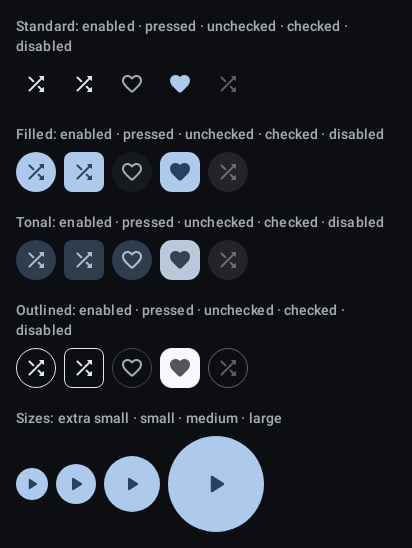
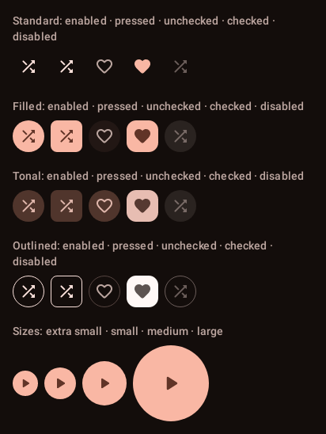
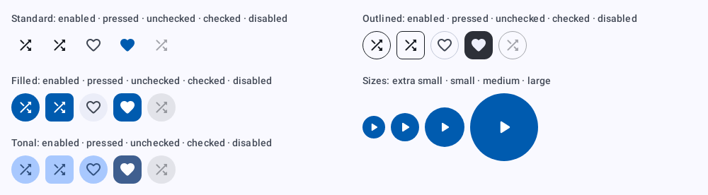
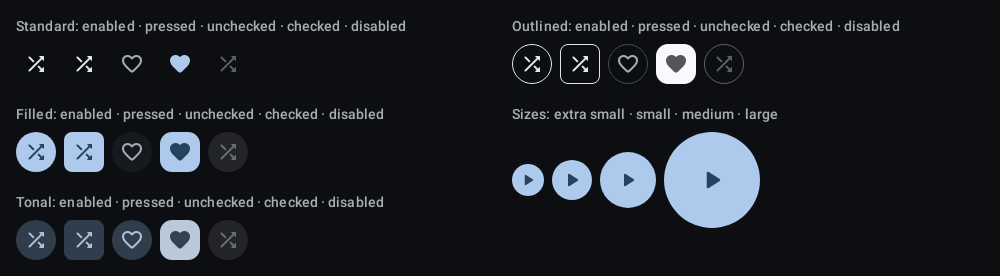

# `icon-button`: Icon button

[All components](index.md)

States: standard, filled, tonal, outlined; enabled, pressed, unchecked, checked, disabled; extra small to large.

## Compact, light

| Brand | Warm seed |
| --- | --- |
|  |  |

## Compact, dark

| Brand | Warm seed |
| --- | --- |
|  |  |

## Expanded, light

| Brand |
| --- |
|  |

## Expanded, dark

| Brand |
| --- |
|  |
