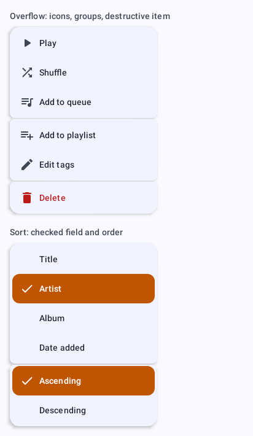
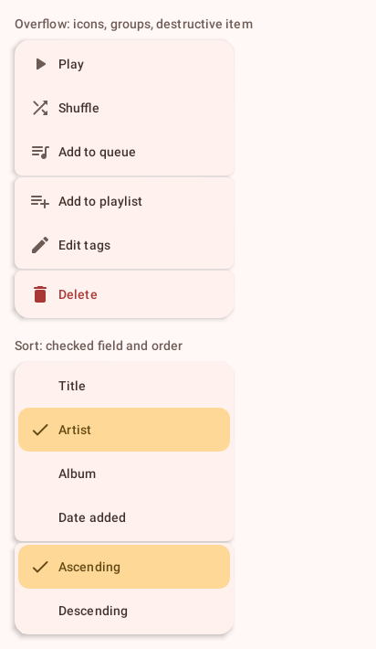
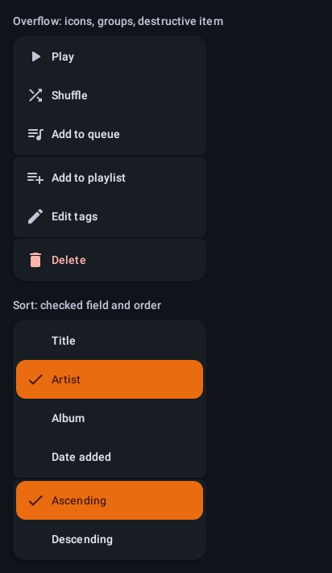
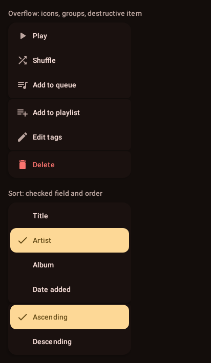
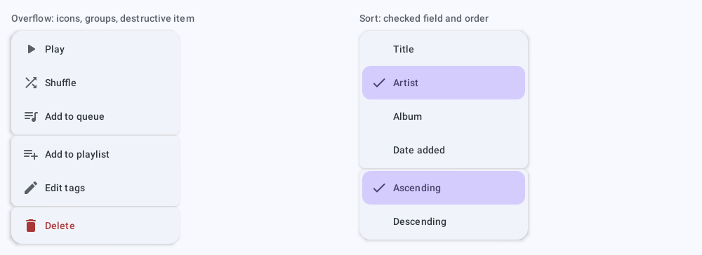
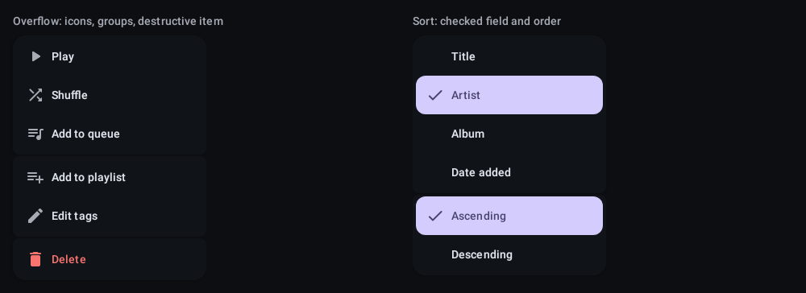

# `menu`: Menu

[All components](index.md)

States: overflow with icons, groups and a destructive item; sort with checked items.

## Compact, light

| Brand | Warm seed |
| --- | --- |
|  |  |

## Compact, dark

| Brand | Warm seed |
| --- | --- |
|  |  |

## Expanded, light

| Brand |
| --- |
|  |

## Expanded, dark

| Brand |
| --- |
|  |
