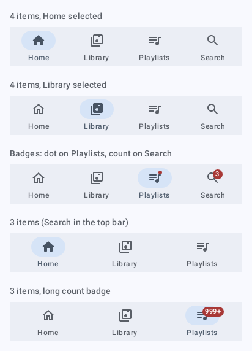
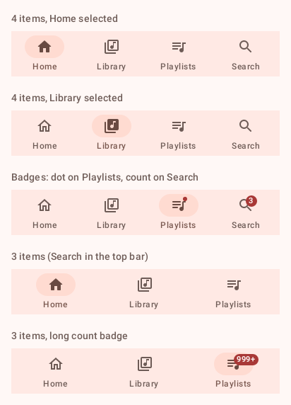
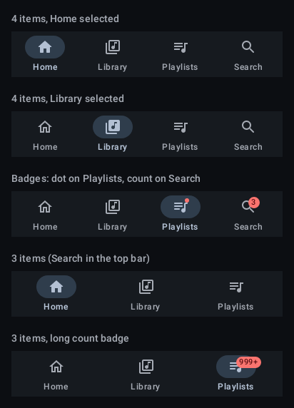
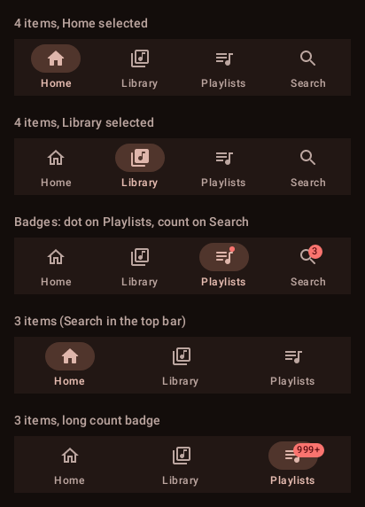
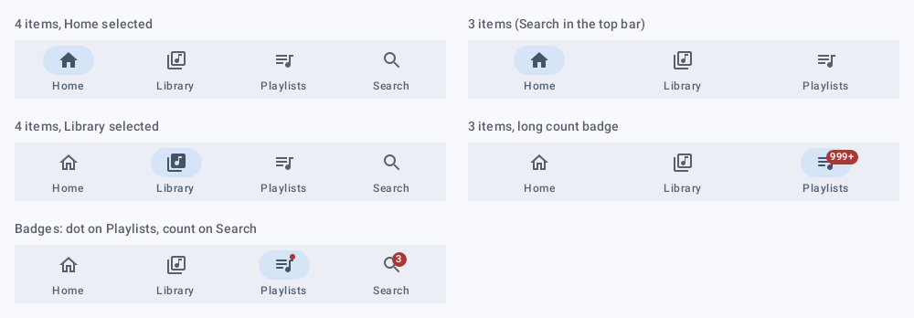
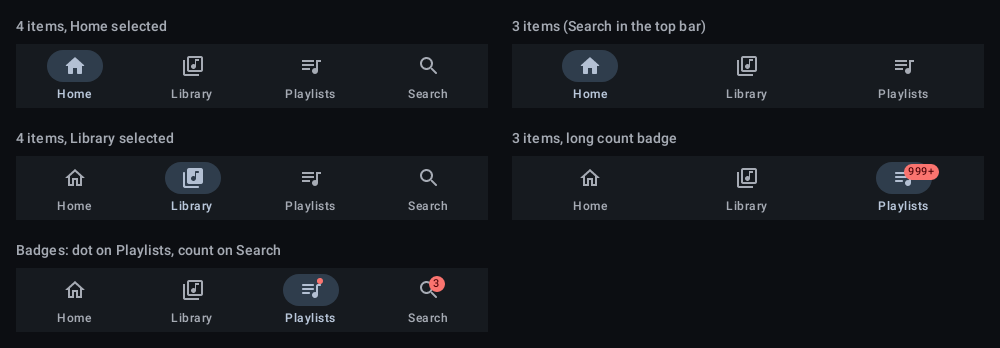

# `nav-bar`: Navigation bar

[All components](index.md)

States: 4 items, each selection; dot and count badges; 3 items; long count.

## Compact, light

| Brand | Warm seed |
| --- | --- |
|  |  |

## Compact, dark

| Brand | Warm seed |
| --- | --- |
|  |  |

## Expanded, light

| Brand |
| --- |
|  |

## Expanded, dark

| Brand |
| --- |
|  |
