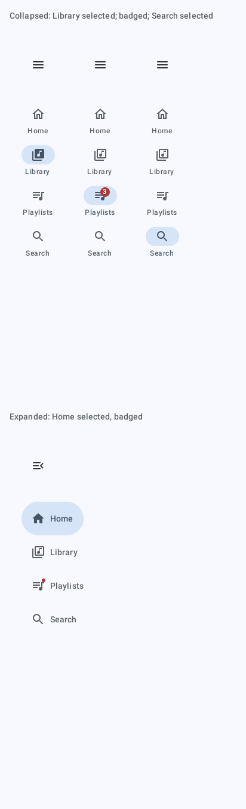
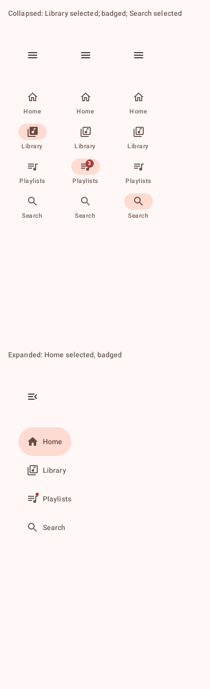
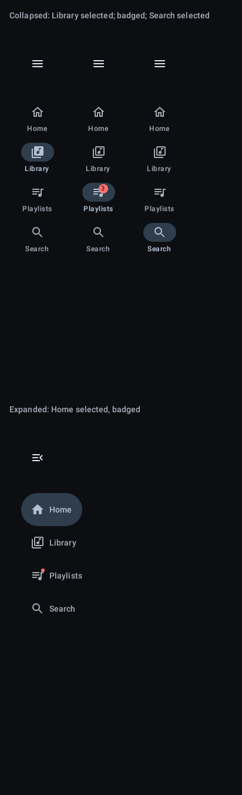
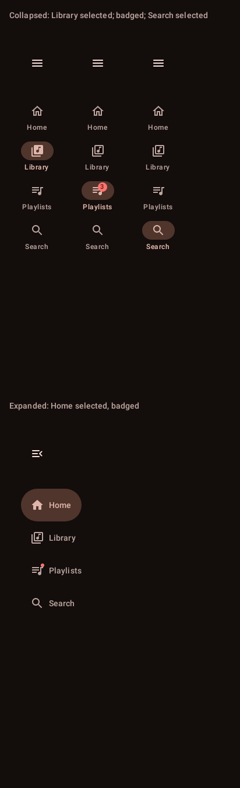
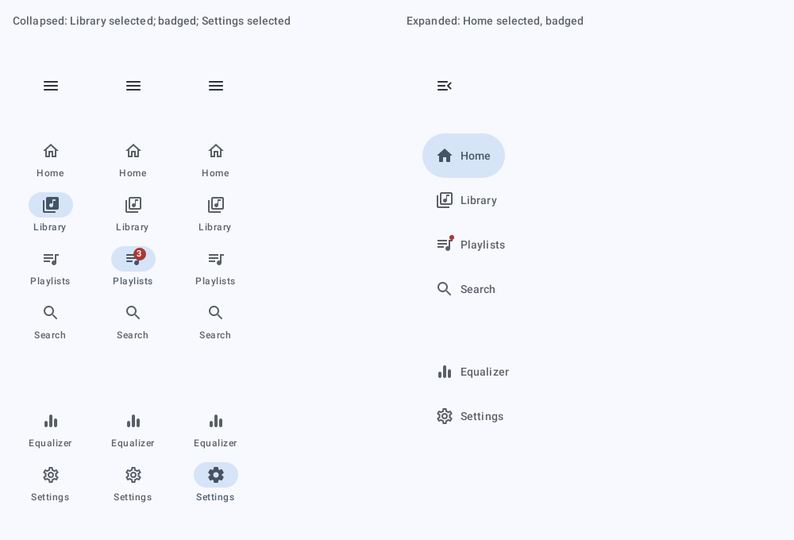
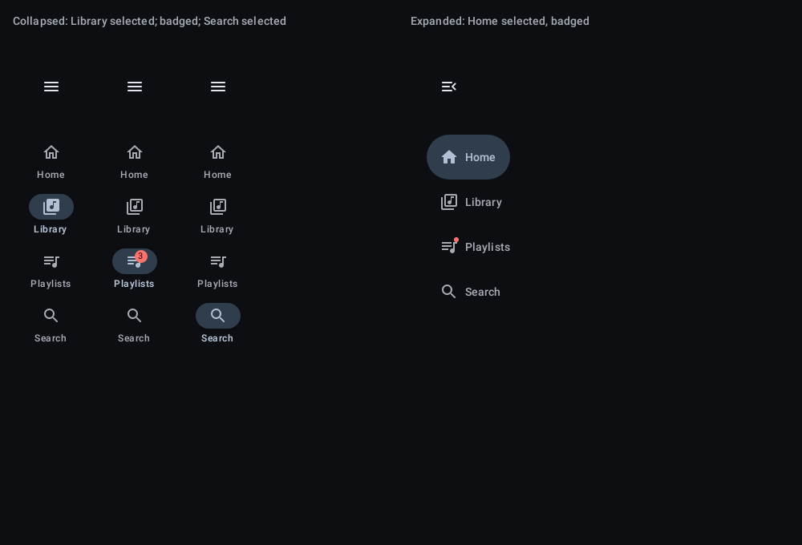

# `nav-rail`: Navigation rail

[All components](index.md)

States: collapsed: selected, badged, secondary selected; expanded with secondary items.

## Compact, light

| Brand | Warm seed |
| --- | --- |
|  |  |

## Compact, dark

| Brand | Warm seed |
| --- | --- |
|  |  |

## Expanded, light

| Brand |
| --- |
|  |

## Expanded, dark

| Brand |
| --- |
|  |
