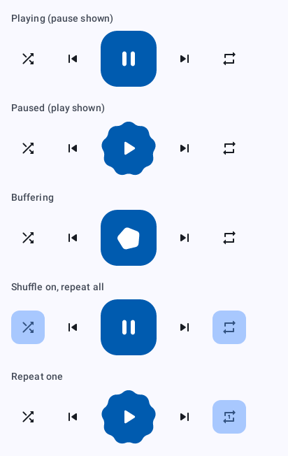
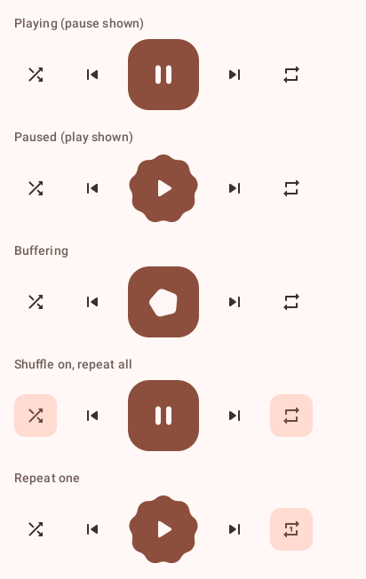
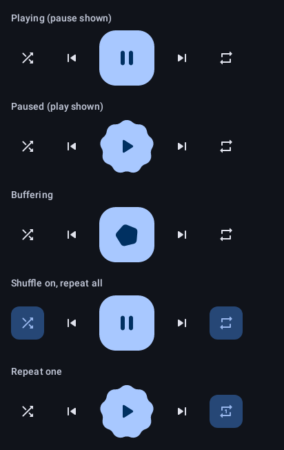
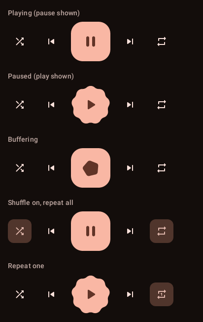
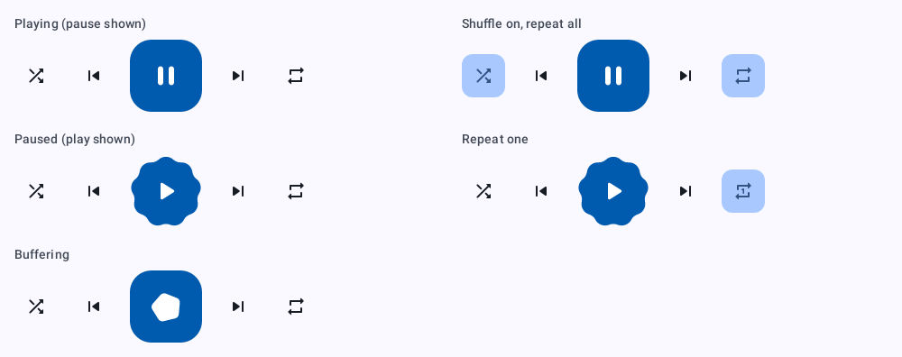
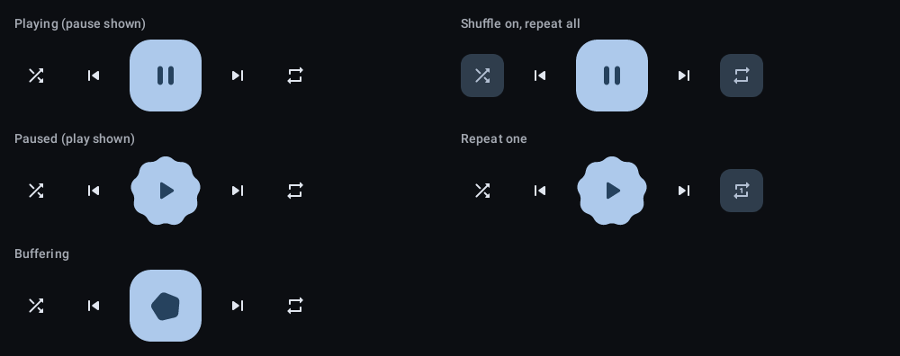

# `player-controls`: Player controls

[All components](index.md)

States: playing; paused; buffering; shuffle on, repeat all; repeat one.

## Compact, light

| Brand | Warm seed |
| --- | --- |
|  |  |

## Compact, dark

| Brand | Warm seed |
| --- | --- |
|  |  |

## Expanded, light

| Brand |
| --- |
|  |

## Expanded, dark

| Brand |
| --- |
|  |
