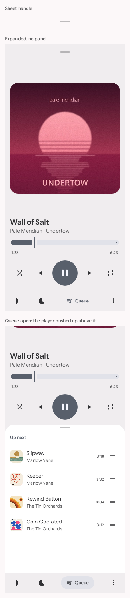
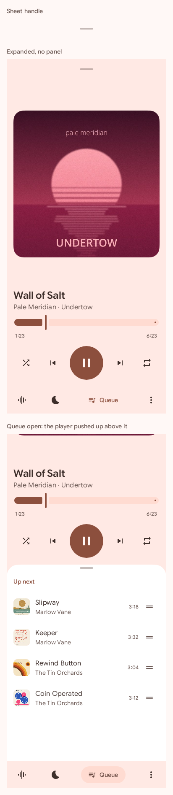
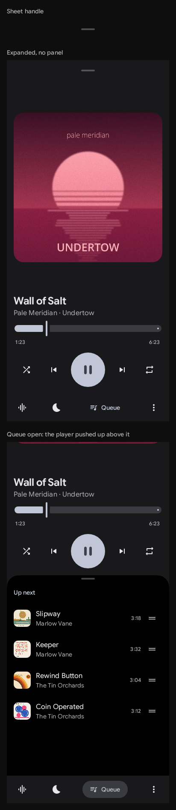
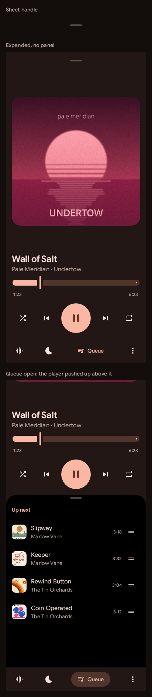
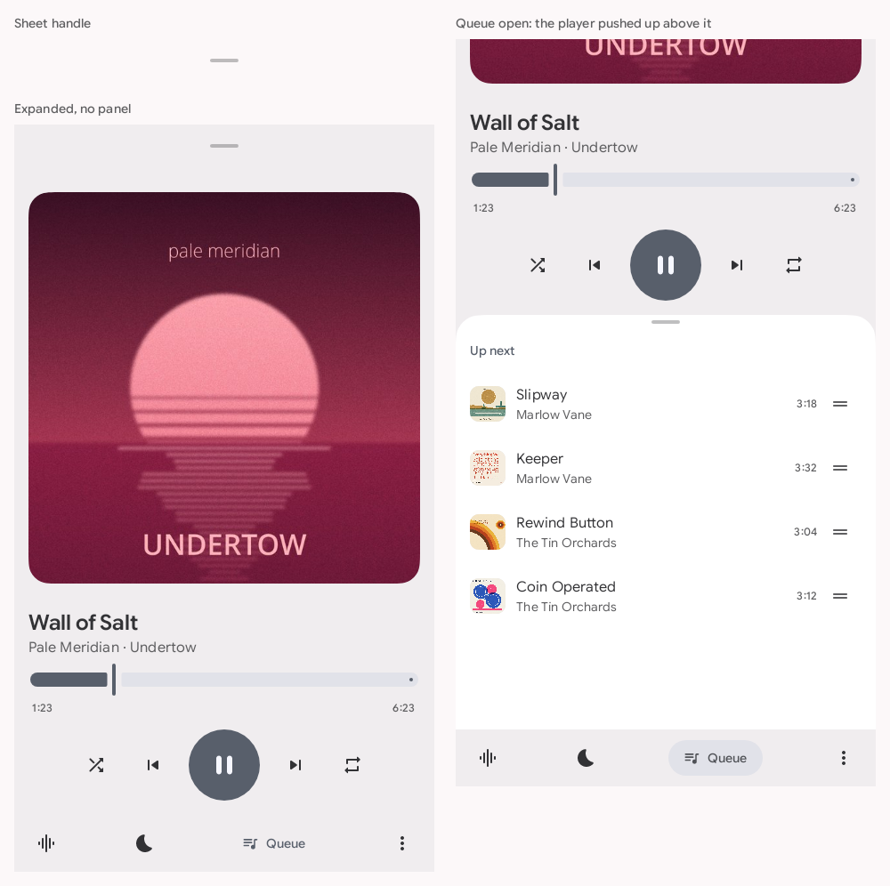
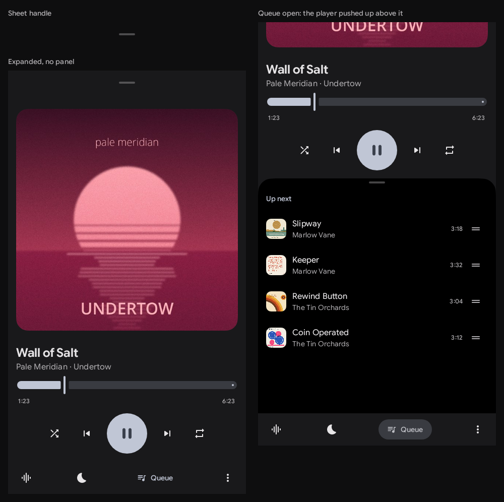

# `player-sheet`: Player sheet

[All components](index.md)

States: sheet handle; expanded, no panel; queue open, player pushed up.

## Compact, light

| Brand | Warm seed |
| --- | --- |
|  |  |

## Compact, dark

| Brand | Warm seed |
| --- | --- |
|  |  |

## Expanded, light

| Brand |
| --- |
|  |

## Expanded, dark

| Brand |
| --- |
|  |
