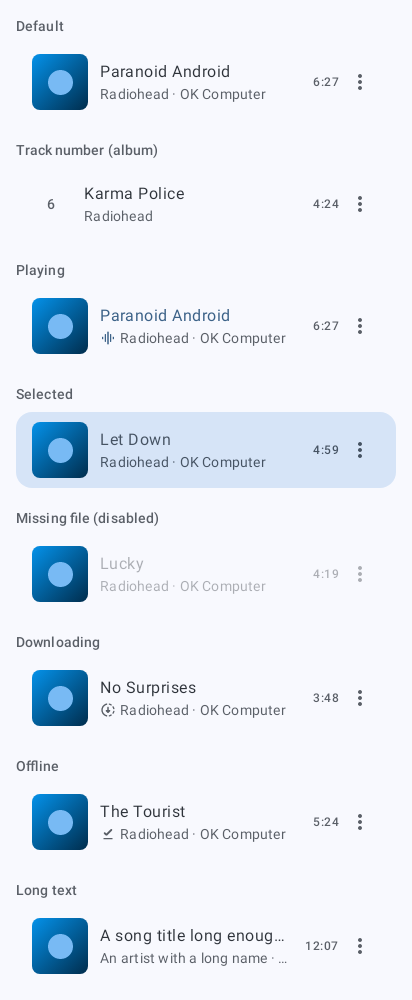
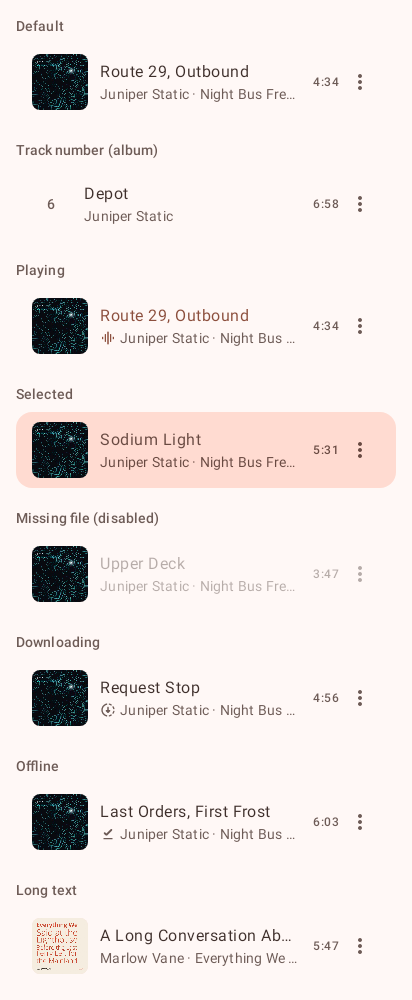
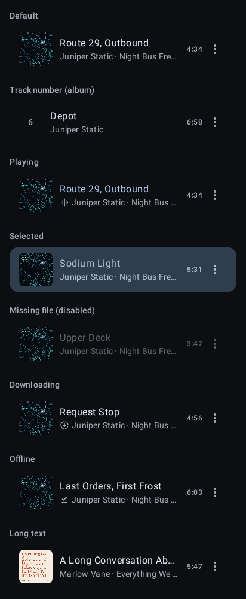
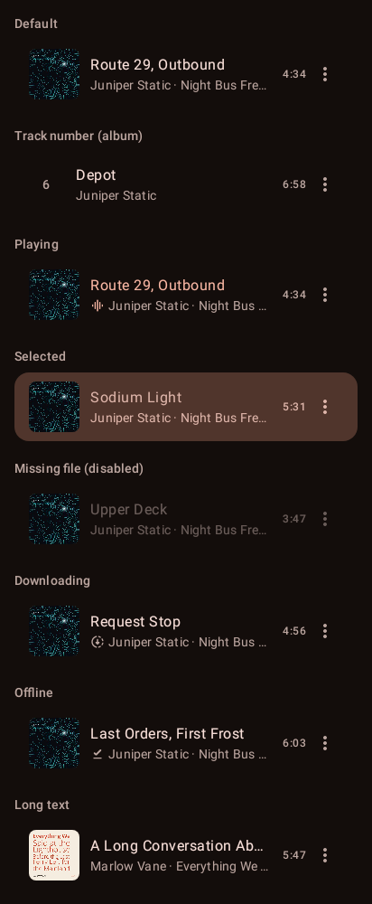
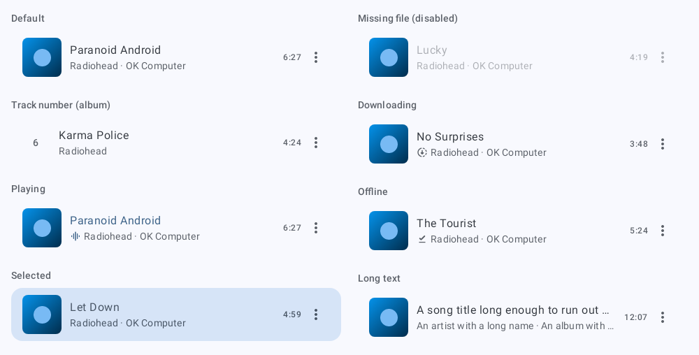
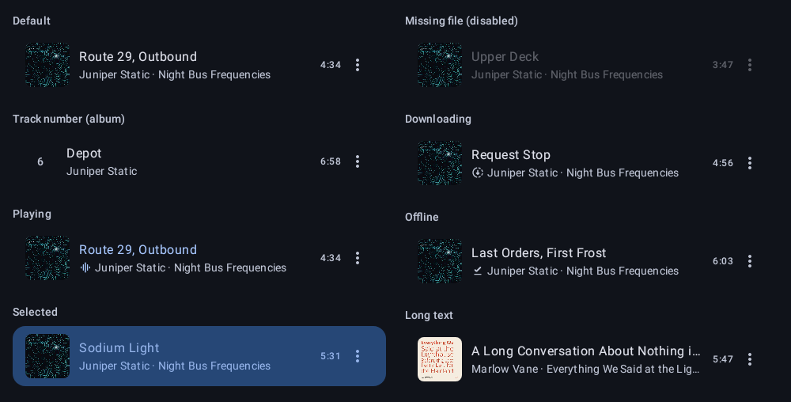

# `row-song`: Song row

[All components](index.md)

States: default; track number; playing; selected; missing file; downloading; offline; long text.

## Compact, light

| Brand | Warm seed |
| --- | --- |
|  |  |

## Compact, dark

| Brand | Warm seed |
| --- | --- |
|  |  |

## Expanded, light

| Brand |
| --- |
|  |

## Expanded, dark

| Brand |
| --- |
|  |
