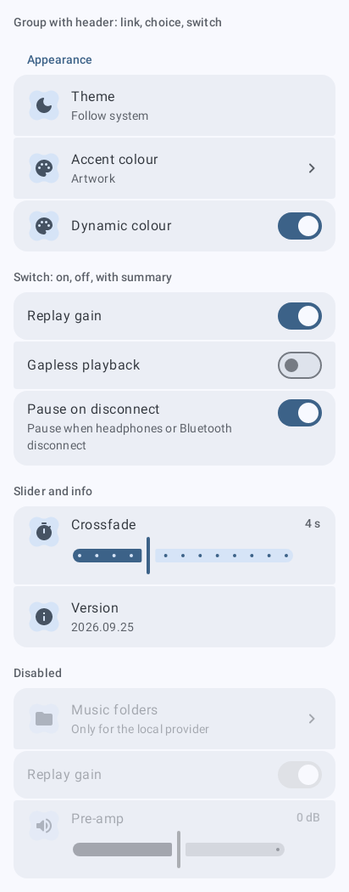
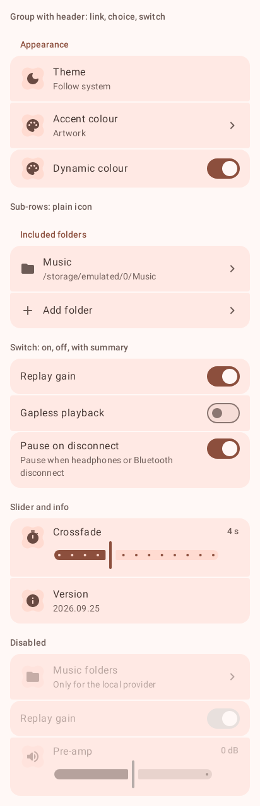
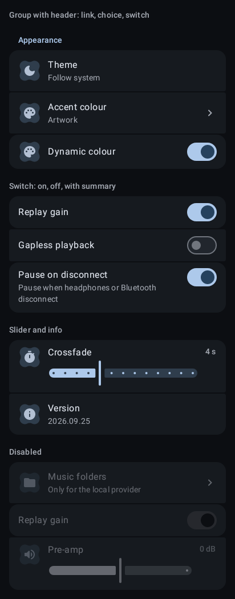
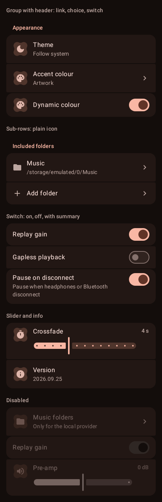
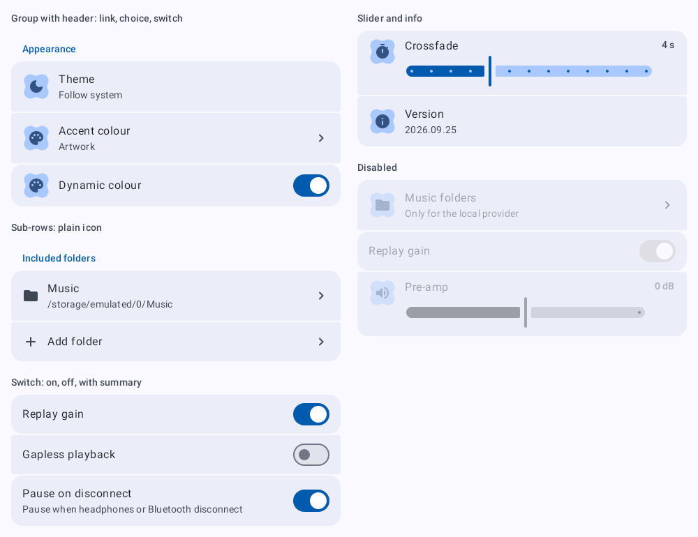
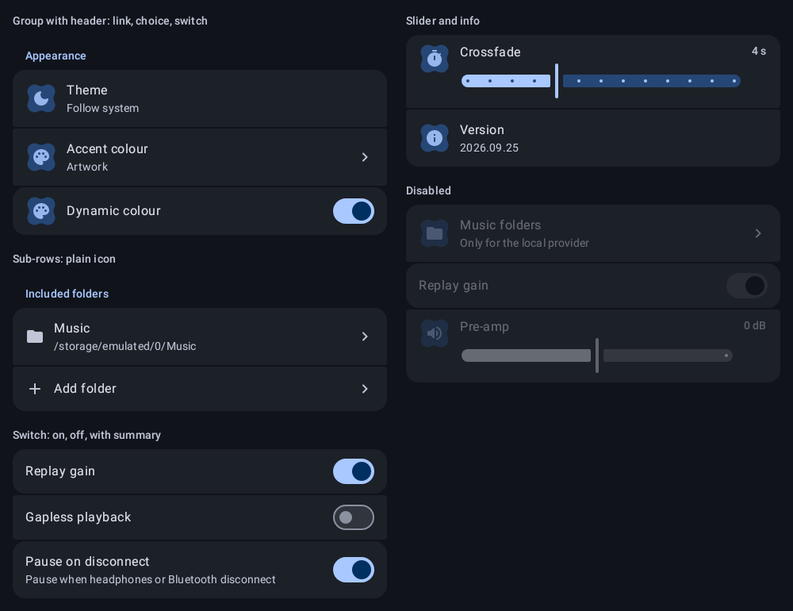

# `setting-row`: Setting rows

[All components](index.md)

States: group with header; switch on, off, with summary; slider and info; disabled.

## Compact, light

| Brand | Warm seed |
| --- | --- |
|  |  |

## Compact, dark

| Brand | Warm seed |
| --- | --- |
|  |  |

## Expanded, light

| Brand |
| --- |
|  |

## Expanded, dark

| Brand |
| --- |
|  |
