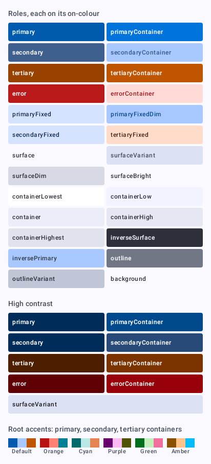
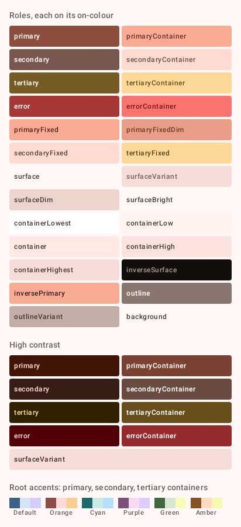
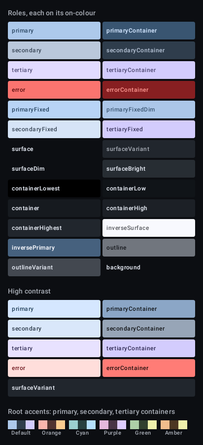
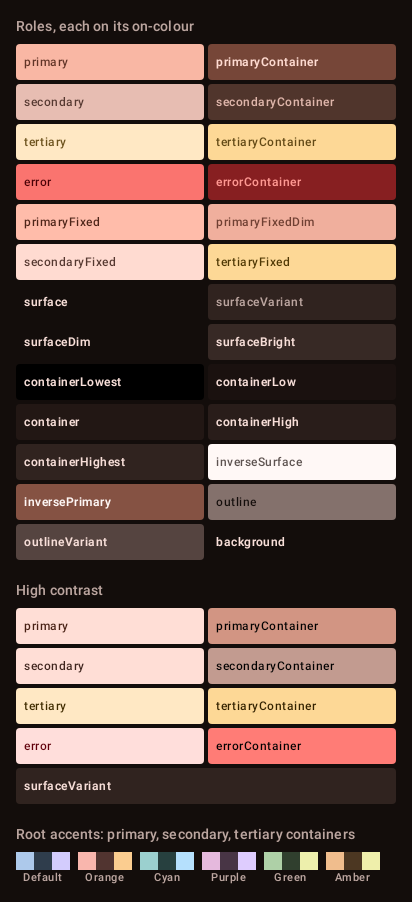
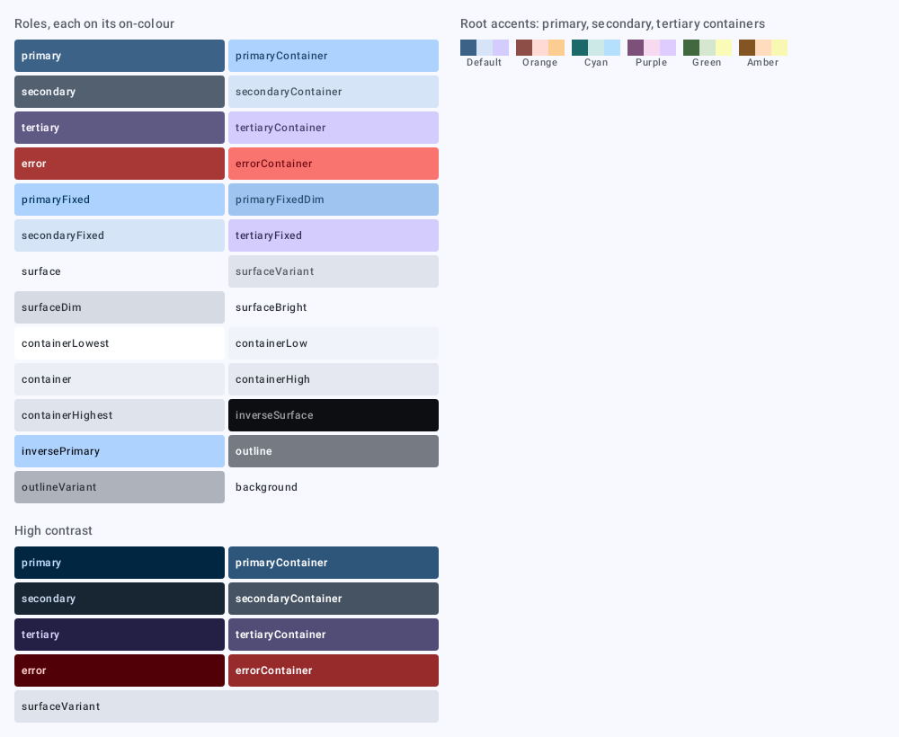
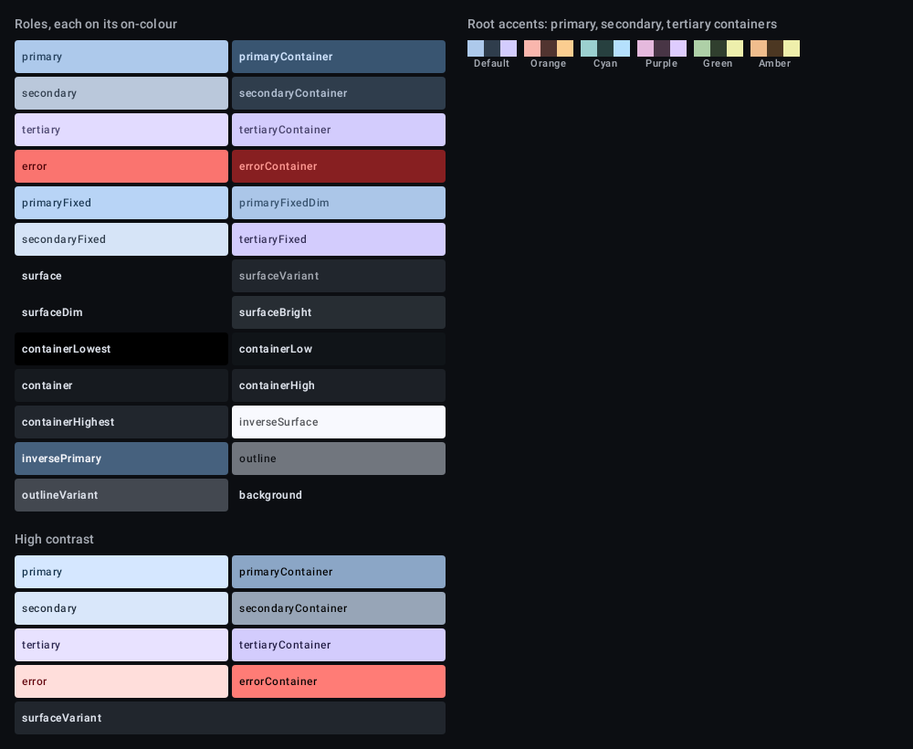

# `theme-colour`: Colour

[All components](index.md)

States: every role with its on-colour; High contrast; the six root accents.

## Compact, light

| Brand | Warm seed |
| --- | --- |
|  |  |

## Compact, dark

| Brand | Warm seed |
| --- | --- |
|  |  |

## Expanded, light

| Brand |
| --- |
|  |

## Expanded, dark

| Brand |
| --- |
|  |
