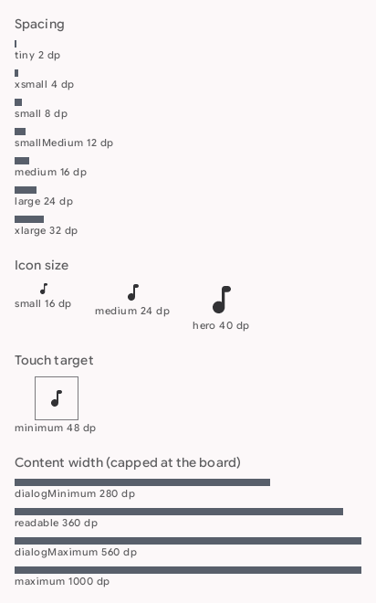
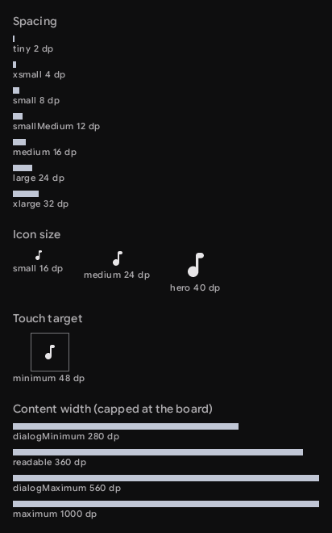
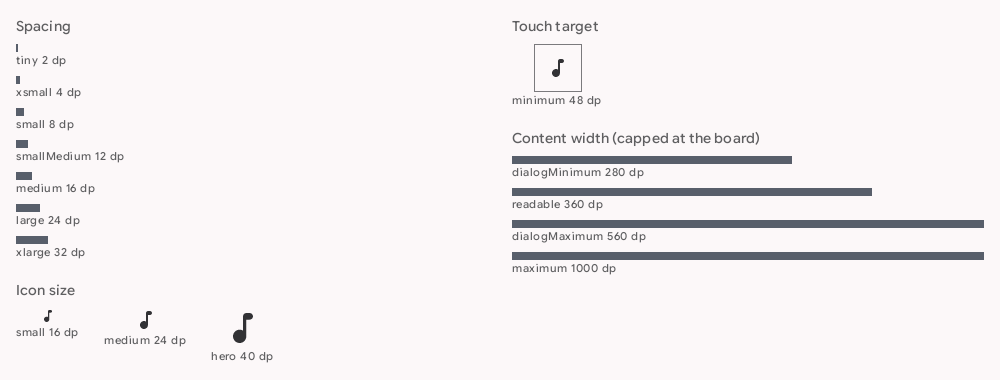
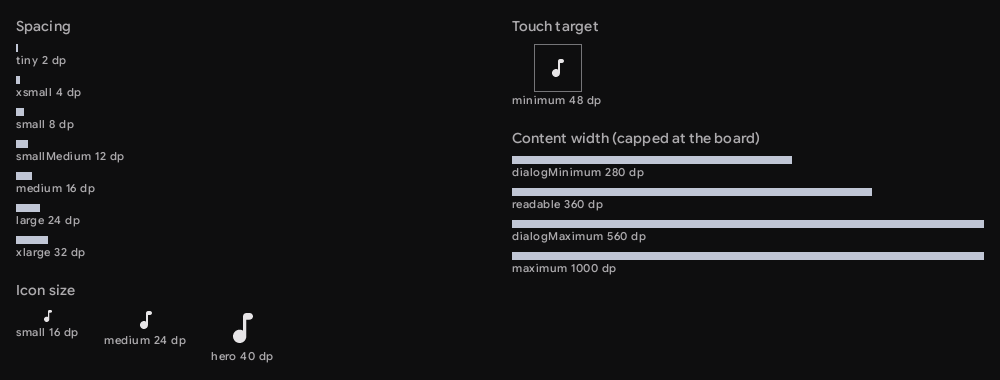

# `theme-dimension`: Dimensions

[All components](index.md)

States: spacing scale; icon sizes; minimum touch target; content widths.

## Compact, light

| Brand |
| --- |
|  |

## Compact, dark

| Brand |
| --- |
|  |

## Expanded, light

| Brand |
| --- |
|  |

## Expanded, dark

| Brand |
| --- |
|  |
