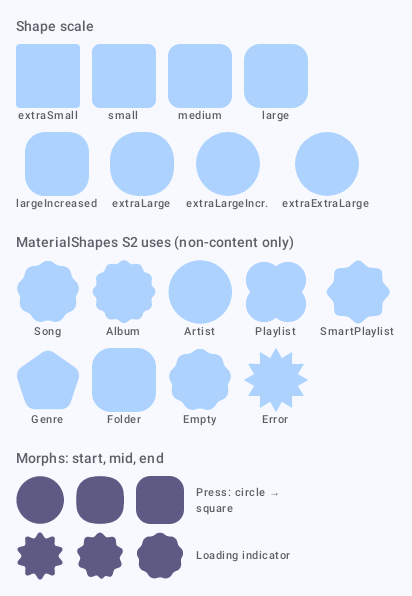
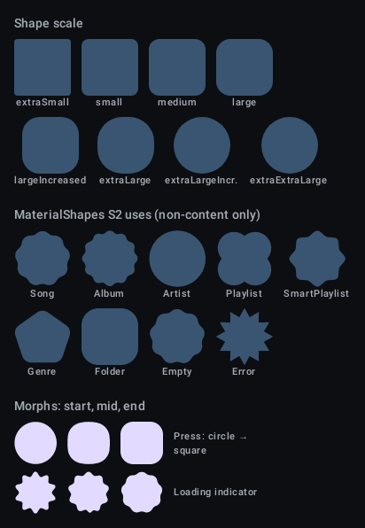
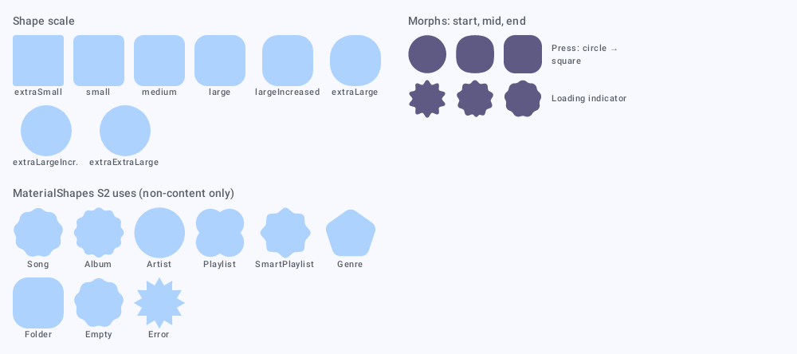
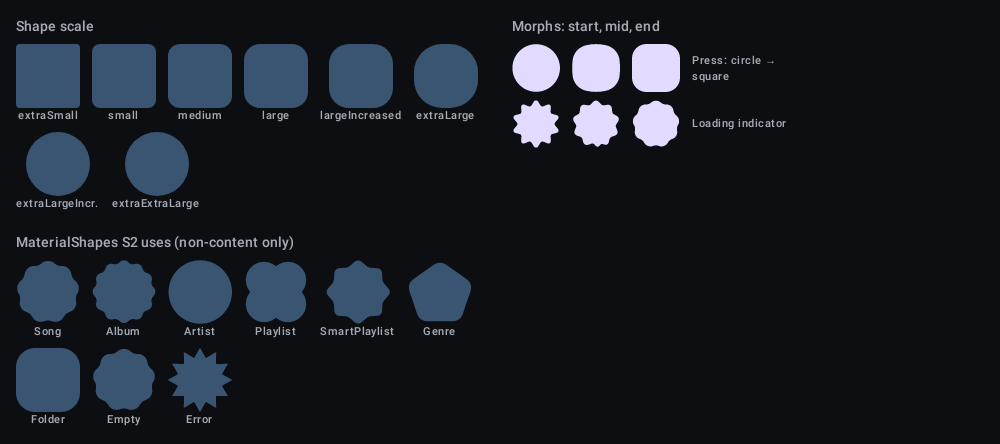

# `theme-shape`: Shape

[All components](index.md)

States: shape scale with the Expressive tokens; MaterialShapes in use; morph strips.

## Compact, light

| Brand |
| --- |
|  |

## Compact, dark

| Brand |
| --- |
|  |

## Expanded, light

| Brand |
| --- |
|  |

## Expanded, dark

| Brand |
| --- |
|  |
