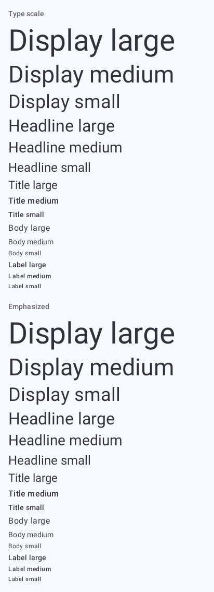
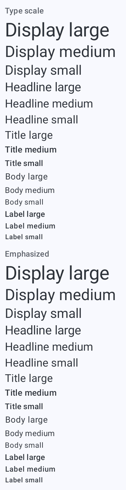
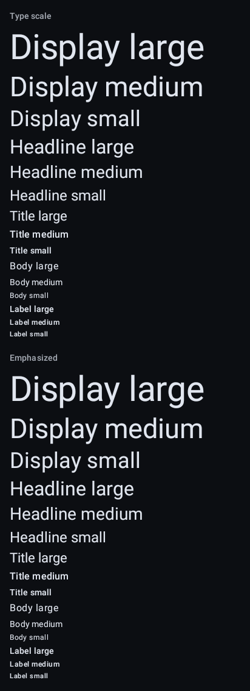
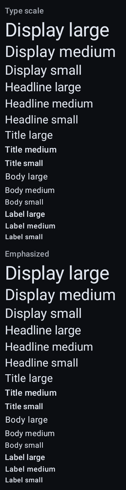
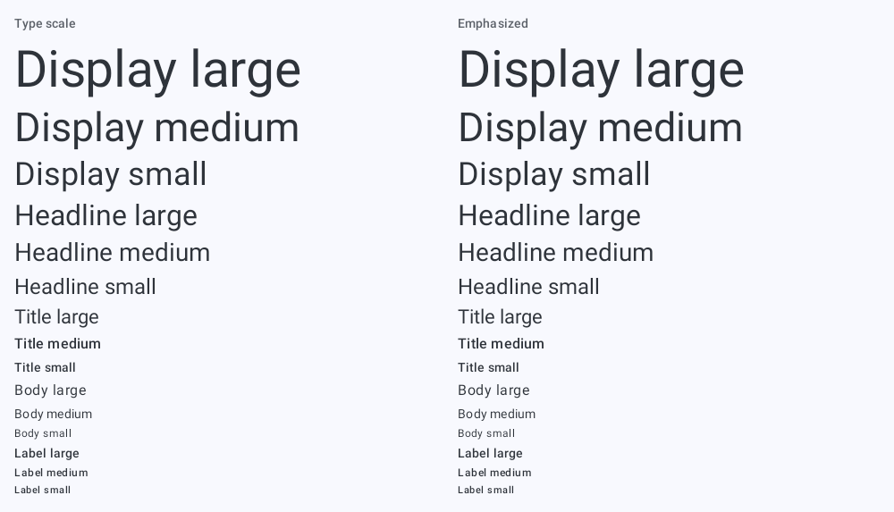
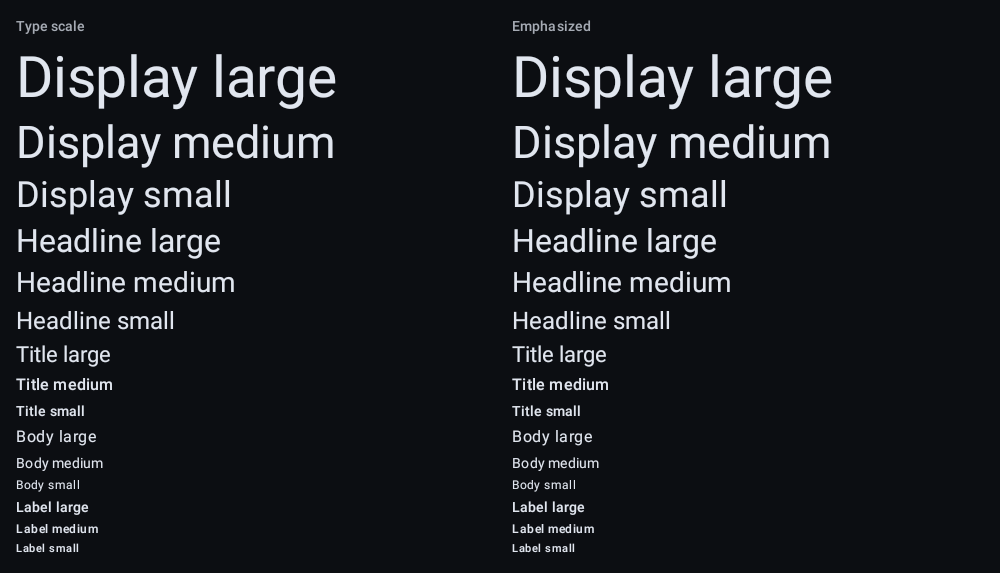

# `theme-type`: Type

[All components](index.md)

States: the 15 styles; the 15 emphasized styles; font scale 1.0 and 2.0.

## Compact, light

| Brand |
| --- |
|  |

## Compact, light, font scale 2

| Brand |
| --- |
|  |

## Compact, dark

| Brand |
| --- |
|  |

## Compact, dark, font scale 2

| Brand |
| --- |
|  |

## Expanded, light

| Brand |
| --- |
|  |

## Expanded, dark

| Brand |
| --- |
|  |
