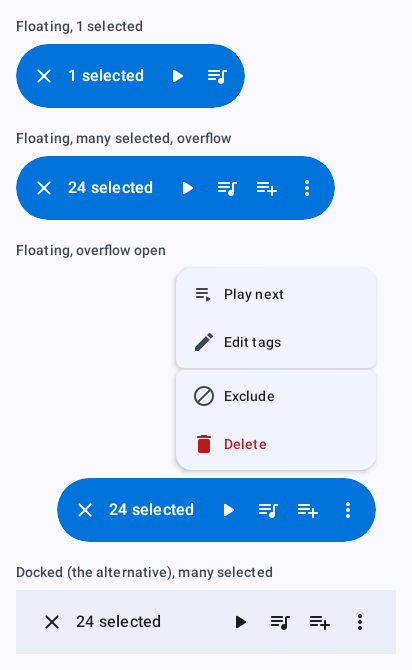
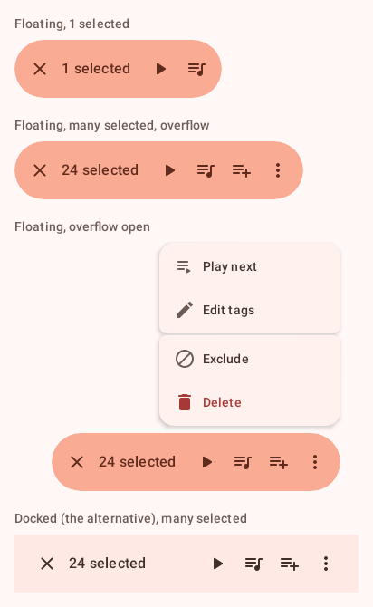
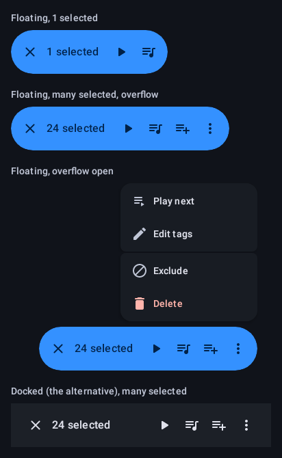
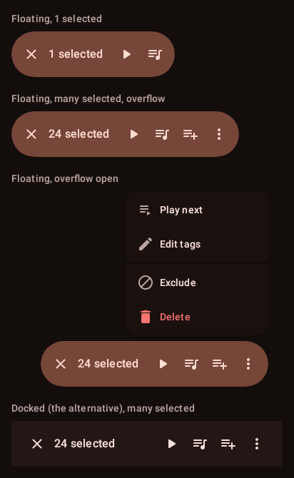
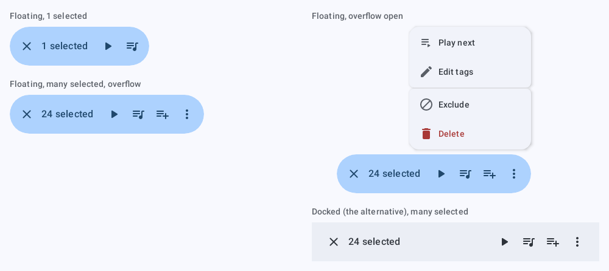
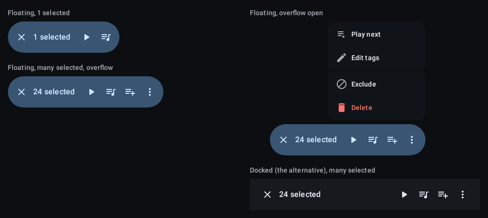

# `toolbar-selection`: Selection toolbar

[All components](index.md)

States: floating, 1 selected; floating, many with overflow; overflow open; docked alternative.

## Compact, light

| Brand | Warm seed |
| --- | --- |
|  |  |

## Compact, dark

| Brand | Warm seed |
| --- | --- |
|  |  |

## Expanded, light

| Brand |
| --- |
|  |

## Expanded, dark

| Brand |
| --- |
|  |
