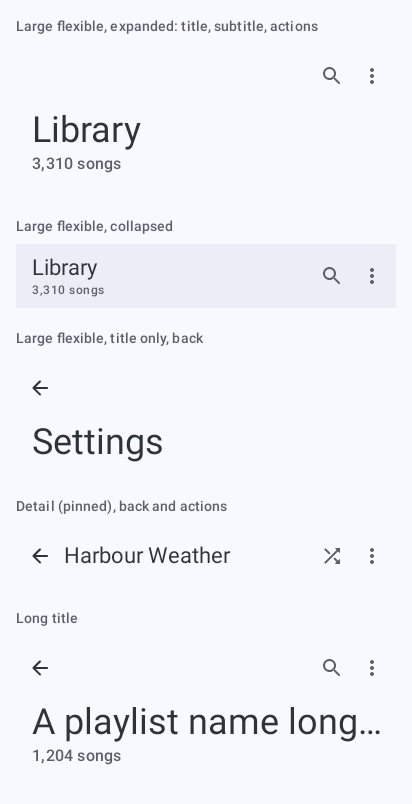
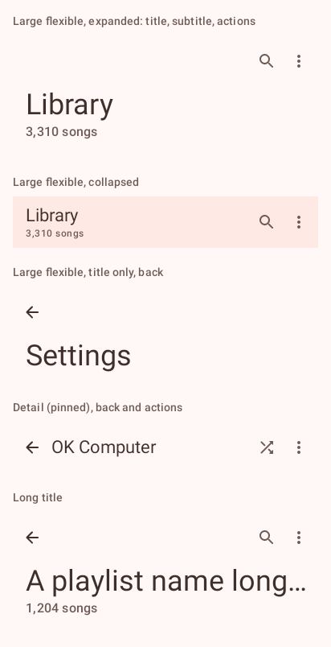
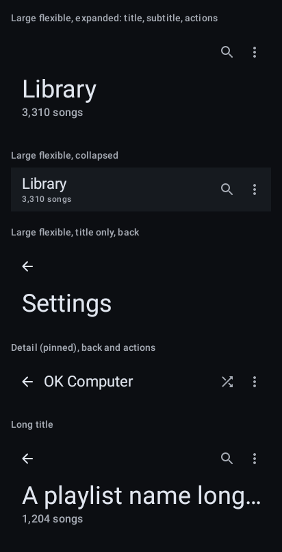
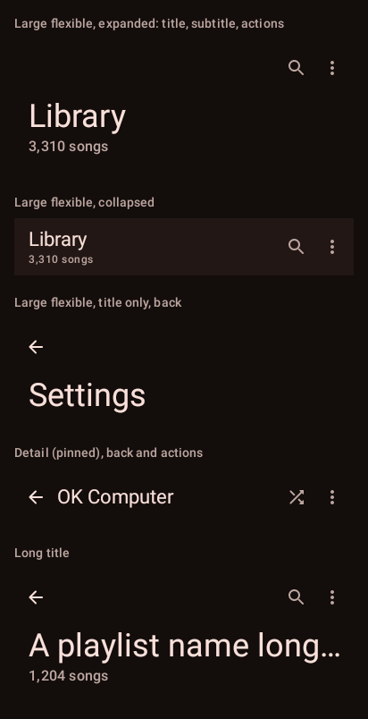

# `top-bar`: Top bar

[All components](index.md)

States: large flexible expanded with subtitle and actions; collapsed; title only with back; detail bar; long title.

## Compact, light

| Brand | Warm seed |
| --- | --- |
|  |  |

## Compact, dark

| Brand | Warm seed |
| --- | --- |
|  |  |

## Expanded, light

| Brand |
| --- |
|  |

## Expanded, dark

| Brand |
| --- |
|  |
